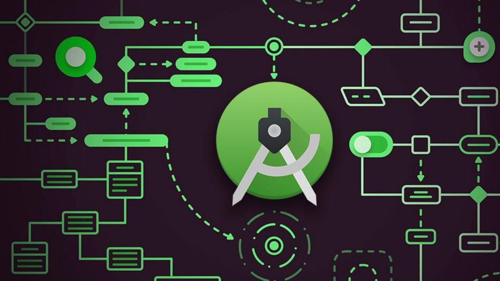
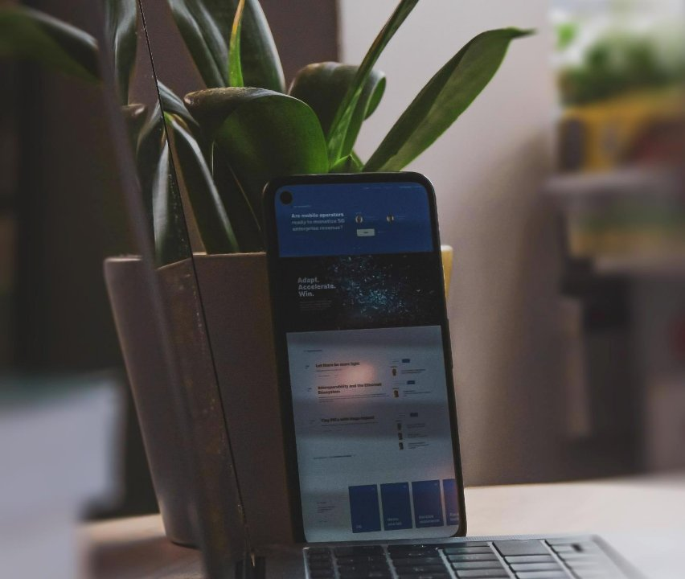



||ANDROID Development|
| :- | :- |
|||
VDA

\- BY MIMO

|Steps To Download|
❑Click To Download[ Android Studio](https://developer.android.com/studio)

❑Click on Download Android Studio

❑Agree to Terms and Condition By scrolling down ❑Click Download Android Studio Button ❑Download has Started
|
| :- | - |

||Double Click on Setup you just have downloaded||Click next||
Check Android Vi Device Option i

already checked cl next
|
| :- | :-: | :- | - | :- | :-: |
|teps To nstall||||
|||Select where you want to install android studio choose SSD if you have for faster response||Click Install||Click next|
trual f 

ick 

S I

Click Finish

Steps to create  Project in Android Studio

❑Open Android Studio ❑Click on New Project

||
❑In phone and Tablet select Empty Activity

❑Click Next

❑Give your Activity a Name

❑Select Directory to store the project or leave it as it is

❑Select language to Kotlin

❑Select Minimum SDK to API 21: Android Studio 5.0 (Lollipop)
|
| :- | - |
❑Un-check use legacy ❑Click Finish

Click on file from 

top navigation Click on setting Click on plugins

Search for  Now search for material theme ui  Click install Atom Material in search bar Icons

Setting UI

Expand 

Appearance and  Click on Material Click Install Behaviour in  theme

Settings

Select Material  Click Apply Oceanic theme

` `file from top navigation  Settings

||Appearance and Behavior|
| - | - |
Setting UI 

Font Size

` `Appearance

Change Size as per your Preference

Navigate to  Expand 

setting Editor 

Setting Up 

Editor font  Select size and  Click on Font andSpacing Line 

Spacing

Change as per your 

preferences

Setting up the AVD

Click on tools from top navigation

Choose pixel 4 with Play Store 

Click on AVD 

Click on + Create Virtual Devices

Choose phone as 

Manager

Category

Support

Click Next

Click X86 Images

Select Android 12 (S) with google APIs

Finish Download

Click Finish

Click on tools from top navigation

Choose pixel 4 with Play Store 

Click on AVD 

Click on + Create Virtual Devices

Choose phone as 

Manager

Category

Support

Now Select Android version we just downloaded

Click Next

Give you AVD a 

Name

Click Finish 

Click on tools from top navigation

Choose pixel 4 with Play Store 

Click on AVD 

Click on + Create Virtual Devices

Choose phone as 

Manager

Category

Support

For Intel Based Pc

Click on tools from top navigation

Choose pixel 4 with Play Store 

Click on AVD 

Click on + Create Virtual Devices

Choose phone as 

Manager

Category

Support

Click Next

Click on Other Images (armd)

Select Android 12 (S) with google APIs

Finish Download

Click Finish

Click on tools from top navigation

Choose pixel 4 with Play Store 

Click on AVD 

Click on + Create Virtual Devices

Choose phone as 

Manager

Category

Support

Now Select Android version we just downloaded

Click Next

Give you AVD a 

Name

Click Finish 

Click on tools from top navigation

Choose pixel 4 with Play Store 

Click on AVD 

Click on + Create Virtual Devices

Choose phone as 

Manager

Category

Support

For Amd Based Pc

THANK YOU

Click here to visit Android[` `**GitHub** ](https://github.com/Mimo2k/Android-Development)repo by Mimo

